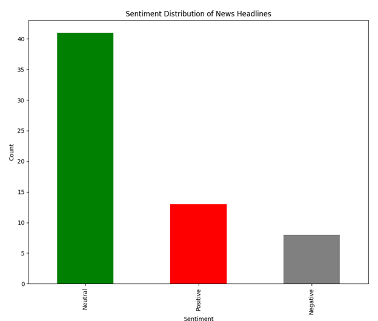
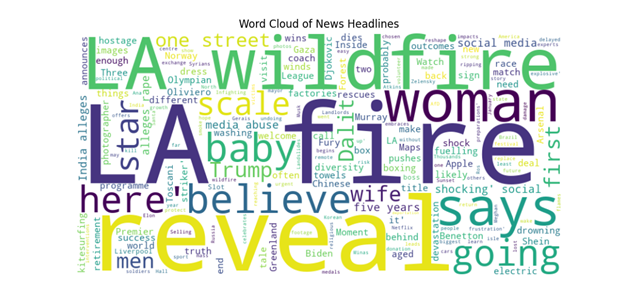

# News Sentiment Analyzer

## Overview

The **News Sentiment Analyzer** is a Python-based project that scrapes trending news headlines from BBC News, performs sentiment analysis, and visualizes the results. It provides insights into whether the news is generally positive, neutral, or negative, along with a word cloud of common keywords.

This project demonstrates my skills in web scraping, natural language processing (NLP), data visualization, and Python scripting.

---

## Features

- **Web Scraping**:
  Scrapes trending headlines from BBC News using `BeautifulSoup`.
  
- **Sentiment Analysis**:
  Uses `TextBlob` to classify headlines as positive, negative, or neutral.

- **Visualization**:
  - Bar chart showing sentiment distribution.
  - Word cloud highlighting frequently used words.

---

## What I Learned

While building this project, I developed and improved skills in:
- **Web Scraping**:
  Extracting data from real-world websites using `BeautifulSoup` and understanding HTML structures.
  
- **Natural Language Processing (NLP)**:
  Performing sentiment analysis using libraries like `TextBlob` and handling textual data effectively.
  
- **Data Visualization**:
  Creating impactful visualizations with `Matplotlib` and `WordCloud`.
  
- **Python Programming**:
  Writing modular, reusable, and readable Python code.

- **Project Workflow**:
  Building a pipeline from data collection to analysis and visualization.

---

## Steps to Run

#### **Step 1: Scrape News Headlines**
Run the `scraper.py` script to scrape trending headlines from BBC News and save them to a CSV file (`news_headlines.csv`):
```bash
python scraper.py
```

#### **Step 2: Analyze Sentiment**
Run the `sentiment.py` script to perform sentiment analysis on the scraped headlines. The results, including the sentiment classification (positive, negative, or neutral), will be saved to `news_with_sentiment.csv`:
```bash
python sentiment.py
```

### Step 3: Visualize Results
Run the `dashboard.py` script to create visualizations:
1. A **Bar Chart** showing sentiment distribution.
2. A **Word Cloud** displaying the most frequent words in the headlines.

```bash
python dashboard.py
```

---

## Project Files

- **`scraper.py`**:
  Scrapes news headlines from BBC News and saves them to a CSV file.

- **`sentiment.py`**:
  Performs sentiment analysis on the scraped headlines and saves the results.

- **`dashboard.py`**:
  Visualizes the sentiment distribution and generates a word cloud.

- **`requirements.txt`**:
  Lists all required Python libraries for the project.

---

## Example Outputs

1. **Sentiment Distribution**:
   

2. **Word Cloud**:
   

---

## Technologies Used

- **Python**:
  Main programming language used for the project.

- **Libraries**:
  - `BeautifulSoup` for web scraping.
  - `TextBlob` for sentiment analysis.
  - `Matplotlib` and `WordCloud` for visualization.

---

## Future Enhancements

- Include links to articles in the visualizations.
- Deploy the project as an interactive dashboard using **Streamlit**.
- Scrape multiple news websites to provide broader sentiment insights.

---


